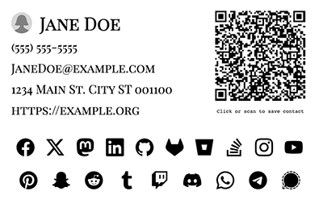

# Digital Business Card Web Component

[](https://opensource.org/licenses/MIT) [](https://github.com/skullzarmy)

A customizable web component for generating digital business cards. Easily embed a business card into your web page with various themes and font variants. This component is lightweight, easy to use, and fully customizable.




## Table of Contents

-   [Features](#features)
-   [Getting Started](#getting-started)
-   [Usage](#usage)
-   [Attributes](#attributes)
-   [Themes and Font Variants](#themes-and-font-variants)
    -   [Examples](https://skullzarmy.github.io/digital-business-cards/example.html)
-   [QR Code](#qr-code)
-   [Roadmap](#roadmap)
-   [Contributing](#contributing)
-   [License](#license)
-   [Contact](#contact)
-   [Acknowledgments](#acknowledgments)

## Features

-   Customizable: Easily change the card's appearance with attributes.
-   Themes: Light and dark themes available.
-   Font Variants: Choose from a variety of font styles.
-   QR Code: Automatically generates a QR code for contact information.
-   Self-contained: No need for external image files; supports Base64 encoded images.

## Getting Started

To get started, include the following script tag in your HTML file:

```html
<script src="https://skullzarmy.github.io/digital-business-cards/digital-business-cards.js"></script>
```

## Prerequisites

No prerequisites are required. The component dynamically loads all necessary resources.

## Installation

Simply include the script in your HTML file, and you're good to go!

```html
<script src="https://skullzarmy.github.io/digital-business-cards/digital-business-cards.js"></script>
```

## Usage

Here's a simple example to embed a digital business card into your web page:

```html
<digital-business-card
    name="John Doe"
    email="johndoe@example.org"
    phone="(555) 555-5555"
    website="https://example.org"
    address="1234 Main St. City ST 001100"
    socialMedia='[{"platform": "facebook", "url": "https://facebook.com/johndoe"}, {"platform": "twitter", "url": "https://twitter.com/johndoe"}, {"platform": "mastodon", "url": "https://mastodon.social/johndoe"}]'
    theme="dark"
    fontVariant="sans"
    imageSrc="data:image/webp;base64,..."
>
</digital-business-card>
```

_View all variants on the [examples page](https://skullzarmy.github.io/digital-business-cards/example.html)_

## Attributes

-   `name`: The name to display on the card.
-   `email`: The email address. Builds `mailto` link.
-   `phone`: The phone number. Builds `tel` link.
-   `website`: The website URL. Builds standard `href` link.
-   `address`: The physical address. Builds link to Google Maps.
-   `socialMedia`: An array of objects, each containing a `platform` and a `url`. The `platform` should match one of the supported social media platforms, and `url` should be the full URL to your profile on that platform.
-   `theme`: The theme of the card (light or dark).
-   `fontVariant`: The font variant (sans, serif, handwritten, gothic).
-   `imageSrc`: The source for the profile image (supports Base64 and image URLs).
-   `imageShape`: The shape of the image (circle or square).

## Theming

### Themes

-   `light`: Light background with dark text.
-   `dark`: Dark background with light text.

### Font Variants

-   `sans`: Sans-serif font.
-   `serif`: Serif font.
-   `script`: Handwritten-style font.
-   `display`: Display-style font.

### Social Media Platforms

The following platforms are supported (icons are predefined):

_icons are from [simpleicons.org](https://simpleicons.org)_

-   Facebook
-   Twitter
-   LinkedIn
-   Mastodon
-   GitHub
-   GitLab
-   Bitbucket
-   Stack Overflow
-   YouTube
-   Instagram
-   Pinterest
-   Snapchat
-   Reddit
-   Tumblr
-   Twitch
-   Discord

To specify social media links, use the socialMedia attribute with an array of objects. Each object should have a platform and a url. For example:

```json
[
    { "platform": "facebook", "url": "https://facebook.com/johndoe" },
    { "platform": "twitter", "url": "https://twitter.com/johndoe" },
    { "platform": "mastodon", "url": "https://mastodon.social/johndoe" }
]
```

## QR Code

The component automatically generates a QR code based on the provided contact information. Users can scan OR click the QR code to save the contact information to their device via standard vCard v3.0 formatting.

## Roadmap

1.  ~~Add support for all standard social media links with logos from simple-icons~~
1.  Add support for any Google font by name
    -   Progress made on refactoring the font loading to load only needed font.
1.  Add custom theme color support
1.  Add custom base font size support
1.  Create component generator

## Contributing

Contributions are welcome! Please read the contributing guidelines first.

## License

This project is licensed under the MIT License - see the [LICENSE](./LICENSE) file for details.

## Contact

-   **Author**: Joe Peterson
-   **Email**: joe@joepeterson.work
-   **Website**: https://joepeterson.work

## Acknowledgments

-   Google Fonts for providing the font styles.
-   QRCode.js for generating QR codes.
-   SimpleIcons.org for providing free and open SVG icons

## Generator

TBD: Link to the generator for this component will be added soon.
